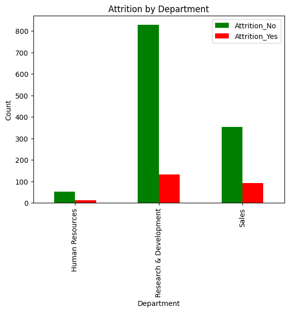

# IDS-706 Data Engineering Assignment
## Project 9 : Cloud-Hosted-Notebook-Data-Manipulation

#### Status(CI/CD) badge for building multiple python versions

### Purpose
This project entails setting up a cloud-based Jupyter Notebook environment on Google Colab, conducting data manipulation on a sample dataset, and integrating the notebook with GitHub for version control and collaborative sharing.

-----------
### Requirements
Set up a cloud-hosted Jupyter Notebook (e.g., Google Colab)
Perform data manipulation tasks on a sample dataset

### Google Colab link
https://colab.research.google.com/drive/1hbTYnKclJRcitQVyD_RRvwUWg67sCOz3?usp=sharing

--------------
### Connetcting Google Colab to Github
1. Create a notebook in Google Colab
2. Save the file via 'Save a copy in Guthub'
3. Any change can be made directly in Google Colab and synced with GitHub

--------------
### Analysis
Dataset : [HR.csv](https://raw.githubusercontent.com/nogibjj/Mini_PJT_9_Cloud-Hosted-Notebook-Data-Manipulation/refs/heads/main/file/HR.csv)
 - The data used in this analysis was provided by IBM and was originally created to study employee turnover.
 - From the available variables, I specifically focused on the "Age" at retirement.
 - Calcuated mean, median, standard Deviation and so on 

Functions :
- `explore data` : Use `describe` to do exploratory data analysis 
- `calculate statistics` : compute the mean(`mean`), median(`median`), standard deviation(`std`) of age
- `plot_age_histogram` : Plot a histrogram to visualize the age distribution of all employees. 
- `plot_attrition_pie_chart` : Create a plot `pie chart` to illustarte the overall attirition. 
- `plot_attrition_by_department` : Create a plot `bar chart` to analyze attrition by departments.

#### Summary Statistics
-----------

#### Attrition analysis
-----------

\
\

### Reference
https://www.youtube.com/watch?v=6Egd-OMLLV4
